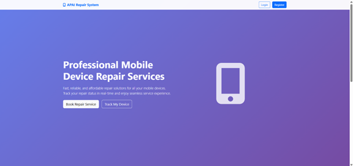
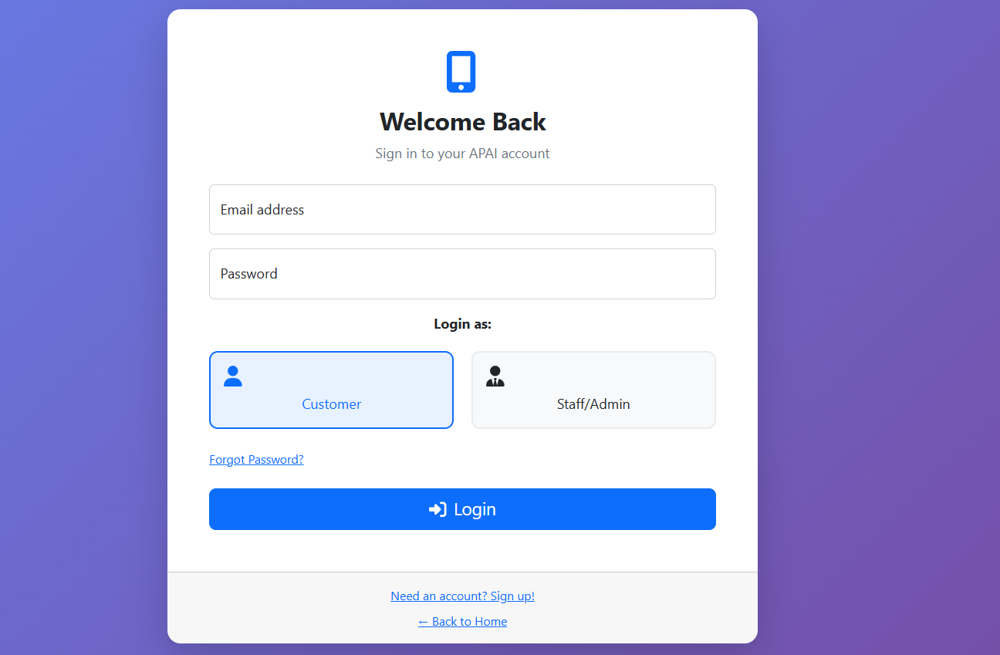
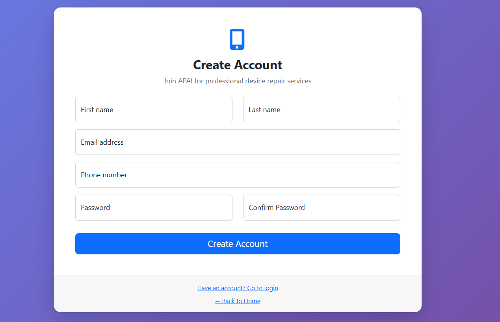
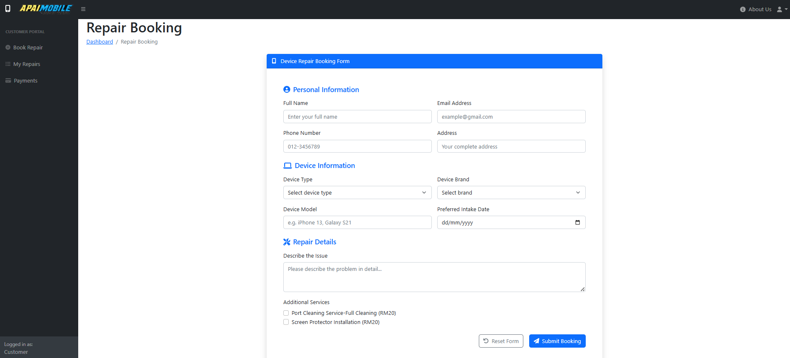

# 📱 Mobile Device Repair System

The **Mobile Device Repair System** is a web-based platform designed to manage repair bookings, payments, inventory, and customer communications for a device repair shop.  
It includes both **customer** and **staff/admin** functionalities to streamline repair operations from booking to payment tracking.

---

## 📌 Features

### **Customer Features**
- 📝 **Online Booking** – Submit repair requests for devices.  
- 📅 **View My Bookings** – Track the status and details of submitted repairs.  
- 💳 **Online Payment** – Secure payment processing for repair services.  
- 🧾 **Invoice Generation** – View and download payment invoices.  
- ℹ️ **About Us Page** – Learn about the repair shop and services offered.

### **Staff/Admin Features**
- 📊 **Dashboard Overview** – Summary of repair orders, payments, and inventory status.  
- 🛠 **Manage Repair Bookings** – Update booking statuses (pending, in progress, completed).  
- 📦 **Inventory Management** – Track and update stock for spare parts.  
- 💰 **Financial Tracking** – Monitor transactions, revenue, and expenses.  
- 🔐 **Staff Login & Logout** – Secure authentication for admin and staff access.

---

## 💻 Tech Stack
- **Frontend:** HTML, CSS, JavaScript
- **Backend:** PHP  
- **Database:** MySQL (phpMyAdmin)  
- **Server:** Apache (XAMPP)

---

## 📸 Screenshots

### Home Page

### Login Page

### New Account Page

### Booking Page

